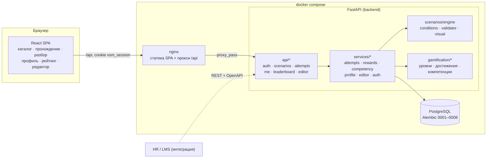
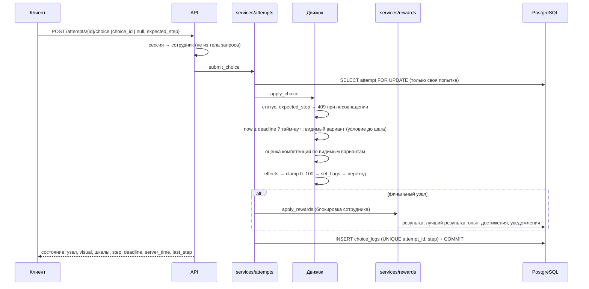

# Архитектура

## Компоненты



- **Один origin.** SPA и API отдаются с одного адреса, cookie сессии first-party, CORS выключен (включается списком `CORS_ORIGINS`).
- **Движок не знает про HTTP и конкретные сценарии.** Весь контент — JSON-граф; новые сценарии, достижения по условиям и
  визуальные метаданные добавляются данными (редактор, импорт JSON, файлы в `backend/app/scenarios/data`).
- **Горизонтальное масштабирование.** Бэкенд без состояния в памяти: сессии, попытки и награды — в PostgreSQL. Корректность при
  нескольких экземплярах обеспечивают блокировки строк и уникальные индексы, а не память процесса.

## Шаг сценария



`GET /attempts/{id}` выполняет ту же транзакцию для просроченного таймера, поэтому восстановленная страница показывает реальный
исход, а награды не дублируются.

## Данные

| Таблица | Назначение |
|---|---|
| `employees` | вымышленные сотрудники: бригада, депо, логин, хэш пароля, роль, признак синтетических данных |
| `auth_sessions` | сессии: SHA-256 токена, срок действия |
| `scenarios` | опубликованная версия (граф, теги, версия), черновик редактора, ключ встроенного сценария |
| `attempts` | попытка: снимок графа и версии, шкалы, флаги, шаг, итоги компетенций, результат и полученный опыт |
| `choice_logs` | шаг попытки: решение или тайм-аут, фактические изменения, оценка компетенций; `UNIQUE(attempt_id, step)` |
| `scenario_bests` | лучший результат сотрудника по сценарию; опыт = их сумма |
| `employee_achievements` | достижения; `UNIQUE(employee_id, achievement_id)` |
| `notifications` | внутренние уведомления |

## Структура репозитория

```
backend/
  app/api/            HTTP-роуты, зависимости авторизации, коды ошибок
  app/services/       сценарии использования: попытки, награды, компетенции, профиль, редактор, вход
  app/scenarios/      движок, условия, валидатор, визуальные метаданные, встроенные сценарии (data/*.json)
  app/gamification/   правила уровней, достижений и компетенций
  migrations/         Alembic
  tests/              pytest (SQLite + отдельный тест гонки на PostgreSQL)
frontend/
  src/pages/          страницы
  src/hooks/          прохождение (useAttemptPlay), загрузка данных
  src/scene/          SVG-вагон, персонажи и настроения
  src/editor/         формы редактора, конструктор условий, операции над графом
docs/                 архитектура, формат сценария, API, правила оценки, маршрут демонстрации
```
